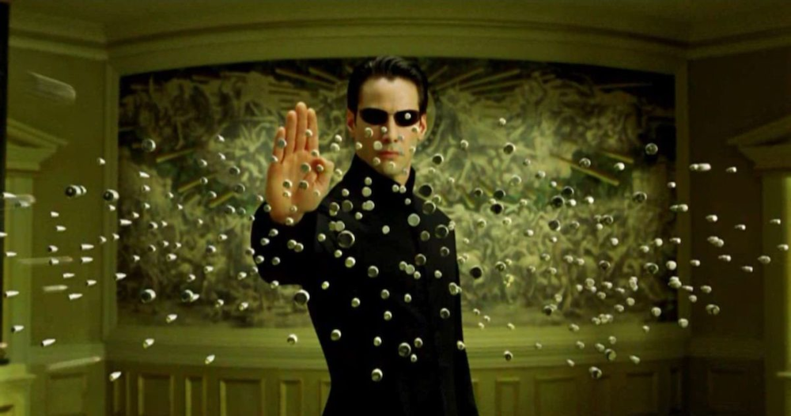

## Developing patterns

Follow along: http://robertdebock.nl/


---

## Who am I

```yaml
name: Robert de Bock
technologies:
  - Linux
  - Ansible
  - Terraform
work: Adfinis Nederland
```

---

## Intent

When developing, it's useful to recognize these levels/phases. It tells you something about:

- Where you are as an engineer.
- I what phase the project is.
- Where time or help is required.

----

## Inspiration

- Beat Rubischon - Work organisation (2021)
- Rafaela Hunodor - Understanding your system (2022)

---

## Levels

0. Learning
1. Manual
2. Automated
3. Consumable
4. ?

Relate to [stages of mastery](http://www.edpsycinteractive.org/edpsyc/stgmstry.html). (Novice, Advanced Beginner, Competence, Proficient & Expert.)

---

## Progress

Typically you step "up" in the levels, but you can also step back "down". Stepping down typically improves:

- Your undestanding of a technology.
- The code.
- "consumability".

Try to enjoy each stage to the fullest.

---

## Timescale

| level      | career      | technology |
| ---------- | ----------- | ---------- |
| learning   | 1-5 years   | some days  |
| manual     | 2-7 years   | some days  |
| automated  | 3-10 years  | 1-2 weeks  |
| consumable | 5-20 years  | 2-3 weeks  |

> Fruit takes time to ripe, don't rush it!

---

## Hope

1. Fixed mindset.
2. Growth mindset.

Source: [Carol Dweck](https://en.wikipedia.org/wiki/Carol_Dweck)

---

## Level 0: learning


----

This phase is almost always where you start in your career or on a new technology. It's a fruststrating phase, but:

> Frustration helps you get to the next phase!

----

## Learning: feelings

Your feelings:

- Unsure.
- Annoyed.
- Slow.
- Confused.
- Magical.

----

## Learning: expressions

- "I need to read more."
- "I don't know when it's done."
- "It's complicated."
- "I'm not talented."

Generally: You don't have a feeling of control. This phase is required.

----

## Learning: overcome

> Everybody needed to learn to bike/ski/code.

---

## Level 1: manual


----

At this moment you are able to do something manual and you can repeat the process.

----

## Manual: feelings

- Still slow.
- Complicated.
- Uncertain how to automate.
- I'm starting to master this!

> Mind the [Dunning Kruger effect](https://en.wikipedia.org/wiki/Dunning–Kruger_effect).

----

## Manual: expressions

- "I am able to show something."
- "A new environment/deployment... That will take a while.
- "It's done, right?"

----

## Manual: overcome

> Be lazy, automate it!

This phase typically comes naturally because of time/budget limitations.

---

## Level 2: automated


----

At this level you are speeding up, because of automation. This requires you to master multiple automation technologies. Having 2 or more languages to automate in helps dramatically. Maybe a few "failed attempts" to master a language are required.

----

## Automated: feelings

- Not proud.
- Urge to refactor.
- Low quality

----

## Automated: expressions

- "It works in my environment."
- "I don't want to publish this code."
- "I'll just show the outcome."
- "Nothing left to do." (WARNING)
- It's a hack-job.

----

## Automated: overcome

> It's done when it's [shippable](https://less.works/less/framework/potentially-shippable-product-increment).

---

## Level 4: consumable



----

In this phase you are starting to see how your code may work in different environments. Your code may have test to prove different scenarios.

----

## Consumable: feelings

- Satisfied.
- Certain.
- (Over?) confident.

----

## Consumable: expressions

- "From now on it's only goldplating."
- "I can't justify to spend more hours on this."
- "Where are my Git(Hub|Lab) stars?"
- "It works, I'm sure!" (WARNING)

## Consumable: overcome

This is the place to be in my opinion, but I may not be able to see the next...

---

## ?

What is after this level/phase/stage is uncertain to me.

---

## Game the system

Once you can work in these different levels (learning, manual, automated, consumable), you can start on an upper level.

1. I nearly always skip "manual", immediately automate it.
2. Focus on making something consumable very early.
3. Focus on tests, they define how to consume the code.

----

## Hack example

> Request: "I want to automatically detect and remediate CVE-2023-12345".

```yaml
cve_2023_12345_detect: yes
cve_2023_12345_remediate: no
```

---

## Conclusion

- There are stages a person or project can be in.
- You can't see beyond the level you master.
- Use your feelings and expressions to estimate progress.

---

## Thanks
