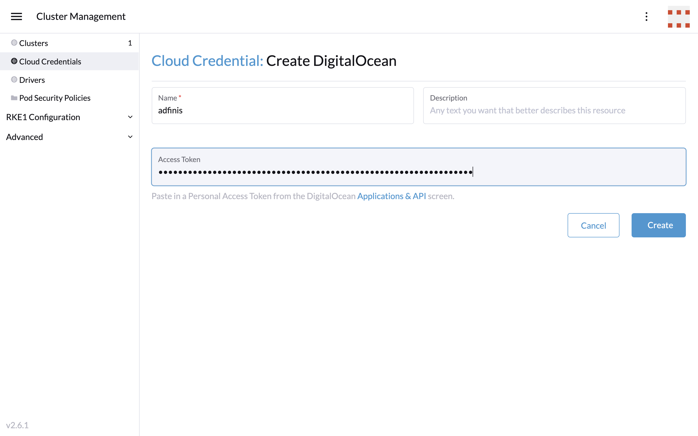

# Rancher

Follow along: http://robertdebock.nl/


---

# Introduction

----

# Adfinis

----

# Robert de Bock

---

# Rancher @adfinis

----

# Adfinis managed

Adfinis uses Rancher to manage Kubernetes clusters.

```text
+--- Adfinis ---+    +--- Azure|DigitalOcean|AWS|GCP ---+
| Rancher       | -> | - Kubernetes cluster x  <---+    |
+---------------+    | - Kubernetes cluster y      |    |
                     | - Kubernetes cluster z      |    |
                     +-----------------------------+----+
                                                   |
                                                   |
                                     +--- Customer x ---+
                                     |                  |
                                     +------------------+
```

----

# Self-managed clusters

Rancher is used by Adfinis' customers.

```text
+--- Azure|DigitalOcean|AWS|GCP ---+    +--- Customer x ---+
| - Kubernetes cluster x  <- - - - | <- | Rancher          |
+----------------------------------+    +------------------+
```

---

# Cloud readiness

Make sure you're [ready](https://cloudy-with-containers.ch/) for the journey.

---

# Demo

----

# Start Rancher container

As ~~stolen~~ [described](https://rancher.com/quick-start/) by Rancher:

```
docker run \
  --privileged \
  --detach \
  --restart=unless-stopped \
  --publish 80:80 \
  --publish 443:443 \
  rancher/rancher
```

N.B. Run this on a resolvable node...

----

# Login to Rancher

----

# Welcome


----

# Get the password


----

# Set the password


----

# Add cloud credentials


----


----



----


----

# Create node template(s)


----


----


----


----

# Create cluster


----


----


----


---

# Your turn!

Go to https://rancher.meinit.nl/

(Use "Adfinis!")

---

# Conclusion

1. It's easy to experiment with Rancher. (Did not follow the [best practices though](https://rancher.com/docs/rancher/v2.x/en/overview/architecture-recommendations/#environment-for-kubernetes-installations).
2. Managing Kubernetes cluster just became a click of a button.
3. You can learn Rancher [yourself](https://academy.rancher.com/) for free.
4. Use [this code](https://github.com/robertdebock/ansible-playbook-rancher) yourself.
